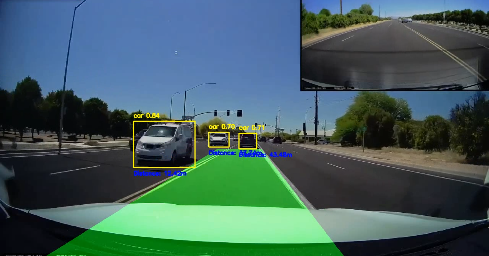

# Lane and Car Detection System Using YOLOv8 and OpenCV

## Overview
This project demonstrates how to build a lane and car detection system using YOLOv8 (You Only Look Once) and OpenCV. The system can detect road lanes and identify vehicles, estimating their distance from the camera. It combines computer vision techniques and deep learning-based object detection to provide a comprehensive understanding of road environments.

## Key Features
- **Lane Detection**: Detects road lanes using edge detection and Hough Line Transformation.
- **Car Detection**: Identifies vehicles using YOLOv8, drawing bounding boxes around them.
- **Distance Estimation**: Calculates the distance of detected cars from the camera based on bounding box size.

# Installation
1. Clone the repository:
   ```
    git clone https://github.com/yourusername/lane-car-detection-yolov8.git
    ```
2. Install the dependencies:
   ```
   pip install opencv-python-headless numpy ultralytics
   ```
3. Run the video.py file.
   
# How It Works
## 1. Lane Detection Pipeline
The lane detection process consists of the following steps:

**Step 1:** Masking the Region of Interest (ROI)
Only the lower part of the image (where lanes are typically visible) is processed.
```
def region_of_interest(img, vertices):
    mask = np.zeros_like(img)
    match_mask_color = 255
    cv2.fillPoly(mask, vertices, match_mask_color)
    masked_image = cv2.bitwise_and(img, mask)
    return masked_image
```
**Step 2:** Edge Detection using Canny
We convert the image to grayscale and apply Canny Edge Detection to highlight the edges.
```
gray_image = cv2.cvtColor(image, cv2.COLOR_RGB2GRAY)
cannyed_image = cv2.Canny(gray_image, 100, 200)
```
**Step 3:** Hough Line Transformation
Hough Line Transformation is applied to detect line segments representing the lanes.
```
lines = cv2.HoughLinesP(
    cropped_image,
    rho=6,
    theta=np.pi / 60,
    threshold=160,
    lines=np.array([]),
    minLineLength=40,
    maxLineGap=25
)
```
## 2. Car Detection Using YOLOv8
**Step 1:** Load the YOLOv8 Model
We use a pre-trained YOLOv8 model to detect cars in each frame.
```
from ultralytics import YOLO
model = YOLO('weights/yolov8n.pt')
```
**Step 2:** Draw Bounding Boxes
For each detected car, we draw bounding boxes and display the class name (car) with a confidence score.
```
for box in boxes:
    x1, y1, x2, y2 = map(int, box.xyxy[0])
    conf = box.conf[0]
    if model.names[cls] == 'car' and conf >= 0.5:
        label = f'{model.names[cls]} {conf:.2f}'
        cv2.rectangle(lane_frame, (x1, y1), (x2, y2), (0, 255, 255), 2)
        cv2.putText(lane_frame, label, (x1, y1 - 10), cv2.FONT_HERSHEY_SIMPLEX, 0.5, (0, 255, 255), 2)
```
3. Distance Estimation
We estimate the distance to each detected car based on the size of the bounding box.
```
def estimate_distance(bbox_width, bbox_height):
    focal_length = 1000  # Example focal length
    known_width = 2.0  # Approximate width of a car (in meters)
    distance = (known_width * focal_length) / bbox_width
    return distance
```
4. Video Processing Pipeline
We combine lane detection, car detection, and distance estimation into a real-time video processing pipeline.
```
while cap.isOpened():
    ret, frame = cap.read()
    if not ret:
        break
    lane_frame = pipeline(resized_frame)
    results = model(resized_frame)
    for result in results:
        # Draw bounding boxes and estimate distance
    cv2.imshow('Lane and Car Detection', lane_frame)
    if cv2.waitKey(1) & 0xFF == ord('q'):
        break
```
# Results
The system detects lanes and cars in real time, displaying bounding boxes for detected vehicles and estimating their distance from the camera.

# Conclusion
This project demonstrates how to use a combination of traditional computer vision techniques and deep learning for detecting lanes and vehicles on the road. By combining lane detection with YOLOv8-based car detection, we can better understand road environments and provide valuable data such as vehicle distances.
# License
This project is licensed under the [MIT License](./LICENSE).
